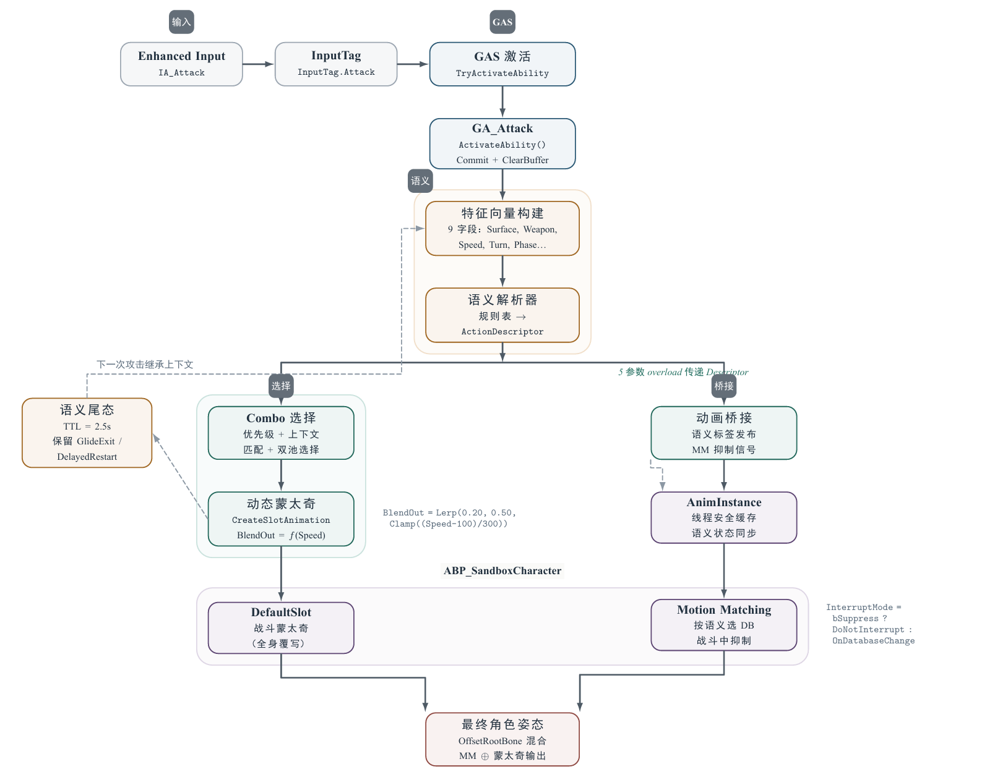
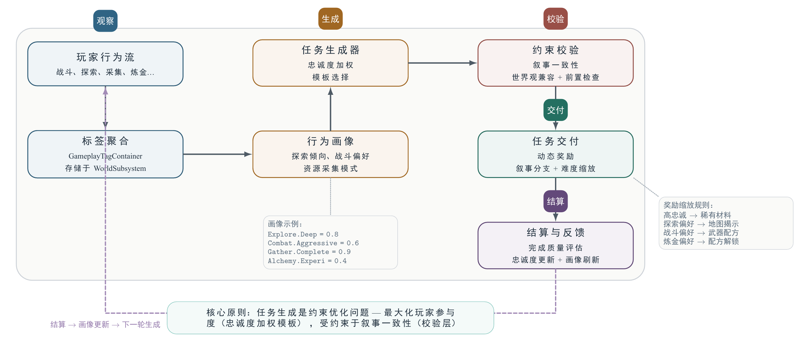

<div align="center">

# Sky Island Potion/feature/combat-system

**语义驱动的 3C 动作 RPG 原型**

Unreal Engine 5.4 · GAS · GASP Motion Matching · PCG · C++

|  | 描述 |
|------|------|
| **战斗触发管线** | 统一链路：`Enhanced Input → InputTag → GAS Ability → Gameplay Tags → Animation Bridge`，全阶段通过标签解析串联 |
| **多语义动作模型** | `环境 × 武器 × 空间动作` 联合解析战斗特征向量为动作描述符，控制连段路线、身体状态和位移行为 |
| **Motion Matching 集成** | 语义层置于 GASP Motion Matching 之上——控制*查询哪些* PoseSearch 数据库以及*何时*在战斗覆写期间抑制 MM |
| **自适应叙事系统** | `Tags + WorldSubsystem` 行为追踪 → 忠诚度加权任务生成 → 约束校验 → 奖励交付 → 闭环反馈 |
| **反应式世界** | 元素反应子系统（`UWorldSubsystem`）+ ElementalZoneActor + PCG 驱动的岛屿生态生成 |

---

## 多语义战斗模型

$$\text{ActionStyle} = f(\text{EnvironmentSemantic},\ \text{WeaponSemantic},\ \text{SpatialActionSemantic},\ \text{BodyState})$$

### 环境语义：世界约束。

| 环境（preview） | 物理效果 | 角色表达 |
|------|---------|---------|
| **冰面** | 低摩擦、高惯性、延迟转向 | 醉拳式地面战斗——滑切、漂移转身、滑倒恢复 |
| **风场** | 空控延展、飞檐走壁能力 | Apex 式移动链——空中改向、借风攀爬 |
| **泥地** | 高摩擦、重着地、移动成本 | 审慎蓄力式打击——无快速转身、重姿态恢复 |

**实现**：`USIPSandboxLocomotionComponent` 应用逐表面移动配置（摩擦/加速度系数、旋转速率覆写），并发布 `State.Surface.*` 标签供下游系统消费。

### 武器语义：战斗意图

| 武器模组（preview） | 战斗意图 | 动作路径 |
|---------|---------|------------|
| **符文匕首** | 近距爆发、角度利用、动量骑乘 | `SlideEntry → DriftSlash → DriftTurnSlash → SlipRecovery` |
| **药瓶架** | 地形借力投掷、节奏切换 | `StanceThrow → ArcLob → QuickRetreat` |
| **魔杖** | 移动施压、横移施法 | `SidestepCast → PressureBeam → RollingRecover` |
| **法杖** | 重蓄力、区域控制 | `WindupSlam → SweepRelease → PlantedRecovery` |

**实现**：`USIPCombatSemanticResolver` 消费 `FSIPCombatFeatureVector`（9 字段的紧凑当前玩法状态表示），解析为 `FSIPCombatActionDescriptor`——包含 `ActionFamily`、`BodyState`、`DesiredVariant`、`MomentumWarp`、`RecoveryBias`、`ChainWindowPolicy`。

### 空间动作语义：空间求解器

| 传统穿越 | 扩展空间动作 |
|---------|------------|
| 翻越、攀爬、攀上 | 冰面滑入 |
| | 风场空中改向 |
| | 踉跄后补偿 |
| | 战斗耦合位移 |
| | 蹬墙跳、边缘起飞 |

**实现**：GASP Traversal 系统（环境射线 → Motion Warping → 穿越蒙太奇）扩展了语义 `SpatialDemand` 字段，设计支持从 `GroundChain` 扩展到 `WallKick`、`AirRedirect`、`GapCross`。

### 语义组合示例

```
Ice + RuneDagger + 高动量 + GroundChain
    → SlideEntry / DriftSlash / DriftTurnSlash / SlipRecovery / GlideExit

Wind + Wand + 空中控制 + AirAdjust           (规划中)
    → AirRedirect / WindBorneCast / GlideStrike

Ice + Flask + 中动量 + GroundChain             (规划中)
    → SlideThrow / SkidLob / RecoveryToss
```

---

## 战斗技术管线



### 输入 → 技能 → 语义解析 → 动画

```
Enhanced Input          Gameplay Ability System          语义层
─────────────          ────────────────────────          ──────
IA_Attack              InputTag.Attack                  FSIPCombatFeatureVector
    │                      │                                │
    └──► InputConfig ──►   ASC.TryActivateAbility ──►      Resolver
                           GA_Attack.ActivateAbility        │
                               │                            ▼
                               │                   FSIPCombatActionDescriptor
                               │                            │
                               ├────────────────────────────┘
                               ▼
                        ┌─ Combo 选择（优先级 + 上下文匹配）
                        │    └─ 动态蒙太奇创建
                        │         └─ DynamicBlendOut = Lerp(0.20, 0.50, Speed)
                        │
                        └─ 动画桥接 (Animation Bridge)
                             ├─ 语义标签 → ASC Loose Tags
                             ├─ 线程安全快照 → AnimInstance
                             ├─ MM 抑制信号 → ABP
                             └─ 尾态 TTL (2.5s) → 语义连续性
```

### 特征向量 → 动作描述符（工作示例）

```
FSIPCombatFeatureVector               FSIPCombatActionDescriptor
═══════════════════════               ══════════════════════════
SurfaceSemantic:  State.Surface.Ice   ActionFamilyTag:  DriftSlash
WeaponModuleTag:  RuneDagger          BodyStateTag:     DriftSlash
GroundSpeed:      340.0               DesiredVariant:   Right (θ<0)
MomentumBand:     High   (≥260)       bMomentumWarp:    true
TurnDemand:       SoftTurn (30°≤θ≤90°) RecoveryBias:     Slow
BalanceState:     Leaning             ChainWindowPolicy: Extended
SignedTurnAngle:  -47.3°              bGoldenPathActive: true
SpatialDemand:    GroundChain
CombatPhaseTag:   Release
        │                                     │
        └──── 显式规则表（非学习权重）────────┘
```

### 初步技术决策

| 决策 | 原因 |
|------|------|
| **单点解析** | GA 在激活时一次性解析 `ActionDescriptor` 并通过 5 参数 overload 传递给 Bridge，消除两个独立解析器之间的帧延迟不一致 |
| **动态 BlendOut** | `Lerp(0.20, 0.50, Clamp((Speed-100)/300))` —— 高动量攻击混出更慢，防止 MM 恢复时的位置不连续 |
| **语义尾态** | Bridge 在攻击结束后保留描述符（如 `DelayedRestart`、`GlideExit`）最多 2.5s，下一次输入继承语义上下文而非重置为中性 |
| **延迟锁定** | 若 GA 激活时 Speed=0（穿越落地），不解析黄金路径；下一帧速度恢复后，Bridge 自动激活语义锁——防止瞬态速度下降打断连锁 |
| **MM 抑制 + 宽限期** | 动作路径蒙太奇期间抑制 MM 搜索，蒙太奇结束后 0.6s 宽限期允许干净混合回归再恢复 MM |

---

## 自适应任务与叙事系统



一个**标签驱动的行为分析管线**，将任务生成视为约束优化问题。

```
┌──────────────────────────────────────────────────────────────────┐
│                        闭环叙事系统                                │
│                                                                  │
│   玩家行为 ──► 标签聚合 ──► 行为画像                               │
│      ▲                            │                              │
│      │                            ▼                              │
│   结算 &            ◄───── 任务生成器                              │
│   反馈更新                  （忠诚度加权模板选择）                    │
│      ▲                            │                              │
│      │                            ▼                              │
│   任务完成           ◄───── 约束校验器                              │
│   + 奖励交付                （叙事一致性检查）                       │
│                                                                  │
└──────────────────────────────────────────────────────────────────┘
```

### 设计原则

| 原则 | 实现 |
|------|------|
| **忠诚度为核心指标** | 任务完成*质量*（而非仅仅完成与否）驱动后续生成参数 |
| **标签化画像** | 玩家行为压缩为 `GameplayTagContainer` —— 探索倾向、战斗偏好、资源采集模式 |
| **约束校验** | 生成的任务必须通过叙事一致性检查后才能交付，防止与世界观矛盾的任务序列 |
| **闭环反馈** | 结算结果直接更新行为画像，形成涌现式任务推进曲线 |

---

## 世界系统(PREVIEW)

### 元素反应子系统(PREVIEW)

基于 `UWorldSubsystem` 实现的**组合式元素交互**：

| 区域元素 | + 输入元素 | → 反应 | 世界效果 |
|---------|----------|--------|---------|
| 植物 | 火 | **燃烧** | 植被清除，路径开辟 |
| 冰 | 火 | **融化** | 冰结构溶解，隐藏区域暴露 |
| 治愈 | 冰 | **冻结** | 水面冻结，形成可行走平台 |
| 治愈 | 雷 | **导电** | 潮湿区域导电，AoE 眩晕区 |
| 植物 | 风 | **绽放** | 孢子散播，新资源节点 |

**架构**：`USIPElementReactionSubsystem` 维护反应查找表。关卡中的 `ASIPElementalZoneActor` 定义区域元素。当 `SIPPotionProjectile` 命中 → 子系统解析反应 → 通过委托广播 → 触发 PCG 内容移除、VFX 生成和环境状态转换。

### PCG 岛屿生态生成(PREVIEW)

`USIPIslandGeneratorComponent` 通过 UE5 PCG 框架提供**逐生态的程序化生成**。每种生态类型映射到独立的 PCG Graph 资产，生成适合地形的植被、矿物沉积和遭遇刷新点。

